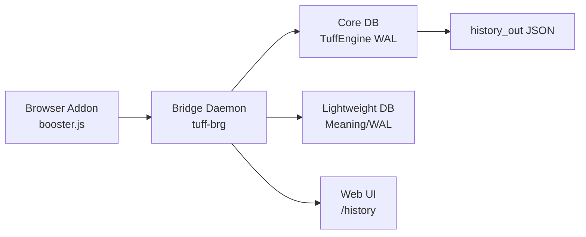
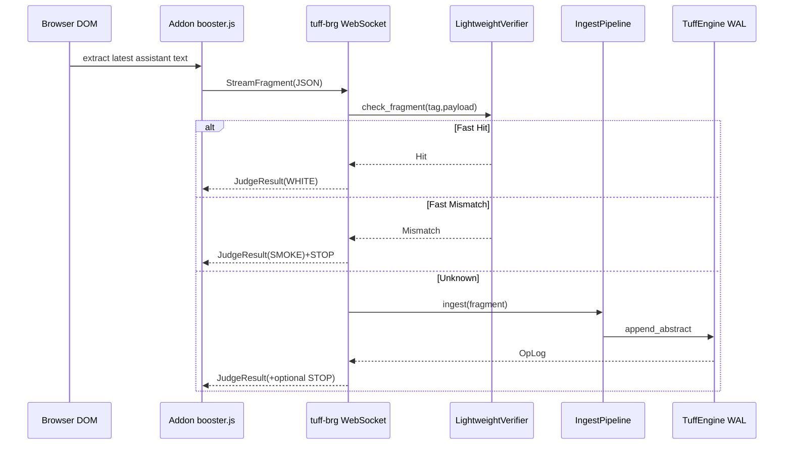
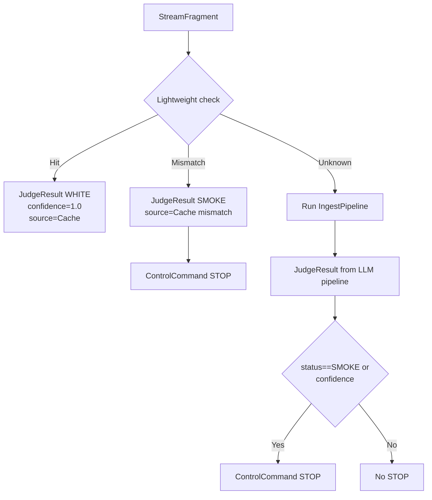
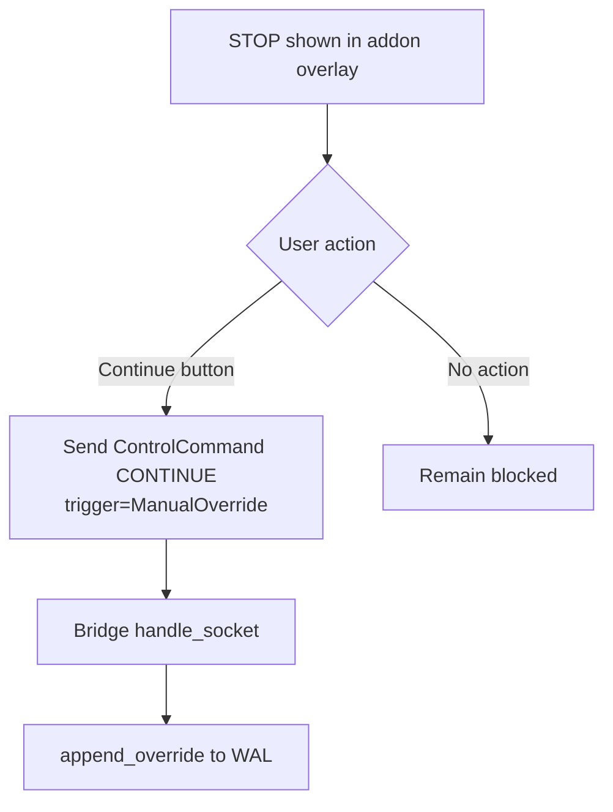

# TUFF-BRG-ECO Repository Overview (Current State)

## Scope
- Scan scope: `tuff-brg/`, `tuff-db/`, `scripts/`, root-level files, `shared/`, `docs/`, `history_out/`.
- Excluded: `target/`, `node_modules/`, `.git/`, `dist/`.
- This document describes only files currently present in the repository.

## Repository Tree
```text
.
├── .env
├── .gitignore
├── AGENTS.md
├── COMMERCIAL.md
├── Cargo.lock
├── Cargo.toml
├── Dockerfile
├── LICENSE
├── README.md
├── REGISTRY_STRUCTURE.txt
├── RELEASE_NOTES.md
├── TUFF-DB Gemini.md
├── ans.json
├── docs/
│   ├── ARCHITECTURE_SPEC.md
│   ├── BUILD_GUIDE.md
│   ├── STATUS.md
│   ├── SUMMARY.md
│   ├── TEST_ACCEPTANCE.md
│   ├── TUFF_BRG_ECO_REPO_OVERVIEW.md
│   ├── Transformer-NEOアーキテクチャの評価.md
│   ├── architecture.md
│   ├── history_schema.md
│   ├── index.md
│   ├── models.md
│   ├── phases.md
│   ├── pipeline.md
│   ├── protocol.md
│   └── wal.md
├── history_out/
│   ├── latest_facts.json
│   └── timeline.json
├── scripts/
│   ├── live_fire_test.sh
│   ├── normalize_lightweight_wal.sh
│   ├── pack_addon.sh
│   ├── regression_check.sh
│   └── test_suite.sh
├── shared/
│   └── selector.js
├── tuff-brg/
│   ├── Cargo.toml
│   ├── addon/
│   │   ├── .firefox-build/
│   │   │   ├── background.js
│   │   │   ├── booster.js
│   │   │   ├── manifest.json
│   │   │   ├── options.html
│   │   │   ├── options.js
│   │   │   ├── popup.html
│   │   │   └── popup.js
│   │   ├── background.js
│   │   ├── booster.js
│   │   ├── build_firefox_addon.sh
│   │   ├── manifest.firefox.json
│   │   ├── manifest.json
│   │   ├── options.html
│   │   ├── options.js
│   │   ├── popup.html
│   │   ├── popup.js
│   │   └── selector.js
│   ├── assets/
│   │   └── history_viewer.html
│   └── src/
│       ├── api/
│       │   ├── message.rs
│       │   └── mod.rs
│       └── main.rs
└── tuff-db/
    ├── Cargo.toml
    └── src/
        ├── bin/
        │   └── history_compile.rs
        ├── db/
        │   ├── api.rs
        │   ├── engine.rs
        │   ├── index.rs
        │   └── mod.rs
        ├── history/
        │   ├── compiler.rs
        │   └── mod.rs
        ├── lib.rs
        ├── lightweight/
        │   ├── main.rs
        │   ├── mod.rs
        │   ├── storage.rs
        │   └── verifier.rs
        ├── main.rs
        ├── models/
        │   ├── abstract_.rs
        │   ├── agent.rs
        │   ├── claim.rs
        │   ├── common.rs
        │   ├── evidence.rs
        │   ├── history.rs
        │   ├── ids.rs
        │   ├── mod.rs
        │   ├── output.rs
        │   └── verify.rs
        └── pipeline/
            ├── fetch.rs
            ├── gap_resolver.rs
            ├── ingest.rs
            ├── llm_abstractor.rs
            ├── llm_verifier.rs
            ├── mock.rs
            ├── mod.rs
            └── traits.rs
```

## Architecture Summary
### 3-Layer Architecture (Addon / Bridge / Lightweight DB)
- Addon (`tuff-brg/addon/booster.js`) collects DOM output fragments, annotates turns, and sends `StreamFragment` over WebSocket.
- Bridge (`tuff-brg/src/main.rs`) receives WebSocket messages, executes fast-path check via `LightweightVerifier`, falls back to ingest pipeline, and returns `JudgeResult` / `ControlCommand`.
- Lightweight DB (`tuff-db/src/lightweight/*`) provides tag-normalized meaning checks, WAL persistence, and mismatch-triggered disconnection logic.

### Data Flow (DOM -> WebSocket -> Daemon -> DB)
- DOM text -> addon fragment extraction (`extractNodeText` / `scheduleSend`) -> `ws://127.0.0.1:8787`.
- Bridge parses `Message::StreamFragment`, writes stream event NDJSON, then pushes latest fragment into watch channel.
- Worker path: fast-path `check_fragment` (hit/mismatch/unknown), then optional LLM ingest pipeline, then WAL append through `TuffEngine`.

### Hybrid Decision Flow (Fast Path / LLM Path)
- Fast Path: `LightweightVerifier::check_fragment` returns `Hit` -> immediate WHITE result; `Mismatch` -> SMOKE + STOP.
- LLM Path: `IngestPipeline::ingest` executes Split -> Fetch -> Verify -> Abstract -> DB append.

### STOP / CONTINUE Control Model
- STOP sent when verification is `SMOKE` or confidence is below threshold (`TUFF_STOP_CONFIDENCE`, default 0.35).
- CONTINUE with `ManualOverride` is accepted from addon; bridge persists `ManualOverride` into DB WAL.

### Semantic Caching Mechanism
- Meaning DB (`meaning.db` + env `TUFF_MEANING_DB`) is loaded to `LightweightVerifier`.
- Tag-normalized match enables immediate judgment and bypasses expensive LLM path.

### Gap Resolver Role
- `LlmGapResolver` resolves discrepancy between internal state and evidence into `Transition` records.
- Wired in `tuff-db/src/main.rs` demo flow (optional when API key is valid).

### Physical Identity Protocol
- `AgentIdentity::current()` fixes `origin` via `OnceLock` + `AI_ORIGIN` env fallback and records `build` version.
- `append_transition` / `append_override` force current agent identity on write.

## Mermaid Diagrams
### High-Level Architecture


### Addon -> Bridge -> DB Flow


### Hybrid Decision Logic


### STOP / CONTINUE Branch


## Transformer Support Mapping
### Cost Reduction via Tag-Based Pre-Inference
- `LightweightVerifier` performs low-cost tag/payload match before LLM verification.
- Cache hit returns immediate `JudgeResult` (WHITE, confidence 1.0), skipping `pipeline.ingest`.

### Reality Consistency Filtering
- Mismatch in fast-path emits SMOKE and STOP immediately.
- LLM path still applies confidence threshold and SMOKE detection for runtime output gating.

### Candidate Narrowing before Full Inference
- Tag normalization (`normalize_tag_key`) and meaning match mode (`Exact`/`Contains`) narrow candidate acceptance set.
- Only unresolved (`Unknown`) fragments enter full fetch/verify/abstract pipeline.

### DOM-Level External Integration Model
- Content script runs on ChatGPT/Gemini hosts and extracts assistant stream text at DOM layer.
- Bridge protocol (`Message` enum) defines JSON transport between browser runtime and Rust daemon.

## File Summaries

### Root-Level Source and Config
#### 1) Path
- `Cargo.toml`

#### Purpose
- Rust workspace definition for `tuff-db` and `tuff-brg`.

#### Main Responsibilities
- Declares workspace members.

#### Key Functions / Structs / Classes
- N/A (TOML config).

#### External Interfaces (if any)
- Cargo workspace loading.

#### Dependencies
- N/A.

#### Runtime Role (Addon / Bridge / DB / Script / Config)
- Config.

#### 2) Path
- `Dockerfile`

#### Purpose
- Container build/runtime packaging for `tuffbrg`.

#### Main Responsibilities
- Multi-stage build, runtime image setup, entrypoint declaration.

#### Key Functions / Structs / Classes
- N/A.

#### External Interfaces (if any)
- Docker build/run (`EXPOSE 8787`, `VOLUME /app/_tuffdb`).

#### Dependencies
- `rust:latest`, `debian:bookworm-slim`, Cargo build.

#### Runtime Role (Addon / Bridge / DB / Script / Config)
- Config.

#### 3) Path
- `.env`

#### Purpose
- Local runtime env defaults for OpenAI model/key and target URL.

#### Main Responsibilities
- Provides `OPENAI_API_KEY`, `OPENAI_MODEL`, `TARGET_URL` examples.

#### Key Functions / Structs / Classes
- N/A.

#### External Interfaces (if any)
- Loaded by `dotenv` in Rust binaries.

#### Dependencies
- dotenv loader.

#### Runtime Role (Addon / Bridge / DB / Script / Config)
- Config.

#### 4) Path
- `.gitignore`

#### Purpose
- Git ignore policy for build/runtime artifacts.

#### Main Responsibilities
- Excludes `target`, `_tuffdb`, `.env`, WAL files.

#### Key Functions / Structs / Classes
- N/A.

#### External Interfaces (if any)
- Git index behavior.

#### Dependencies
- N/A.

#### Runtime Role (Addon / Bridge / DB / Script / Config)
- Config.

#### 5) Path
- `README.md`

#### Purpose
- Project-level architecture and quickstart description.

#### Main Responsibilities
- Documents 3-layer model, env vars, demo scripts.

#### Key Functions / Structs / Classes
- N/A.

#### External Interfaces (if any)
- Human-facing entry document.

#### Dependencies
- N/A.

#### Runtime Role (Addon / Bridge / DB / Script / Config)
- Config.

#### 6) Path
- `RELEASE_NOTES.md`

#### Purpose
- Release summary for prototype version.

#### Main Responsibilities
- Lists key features, packaging, requirements.

#### Key Functions / Structs / Classes
- N/A.

#### External Interfaces (if any)
- Human-facing release notes.

#### Dependencies
- N/A.

#### Runtime Role (Addon / Bridge / DB / Script / Config)
- Config.

#### 7) Path
- `COMMERCIAL.md`

#### Purpose
- Commercial-use terms.

#### Main Responsibilities
- Defines royalty and scope policy text.

#### Key Functions / Structs / Classes
- N/A.

#### External Interfaces (if any)
- Human/legal reference.

#### Dependencies
- N/A.

#### Runtime Role (Addon / Bridge / DB / Script / Config)
- Config.

#### 8) Path
- `AGENTS.md`

#### Purpose
- Agent operation instructions for this repository.

#### Main Responsibilities
- Defines response language, workflow notes, next tasks.

#### Key Functions / Structs / Classes
- N/A.

#### External Interfaces (if any)
- Codex/agent behavior guidance.

#### Dependencies
- N/A.

#### Runtime Role (Addon / Bridge / DB / Script / Config)
- Config.

#### 9) Path
- `LICENSE`

#### Purpose
- License text.

#### Main Responsibilities
- Declares licensing terms.

#### Key Functions / Structs / Classes
- N/A.

#### External Interfaces (if any)
- Legal interface.

#### Dependencies
- N/A.

#### Runtime Role (Addon / Bridge / DB / Script / Config)
- Config.

#### 10) Path
- `REGISTRY_STRUCTURE.txt`

#### Purpose
- Repository structure artifact.

#### Main Responsibilities
- Contains generated structure listing.

#### Key Functions / Structs / Classes
- N/A.

#### External Interfaces (if any)
- Human/tool-readable registry text.

#### Dependencies
- N/A.

#### Runtime Role (Addon / Bridge / DB / Script / Config)
- Config.

#### 11) Path
- `TUFF-DB Gemini.md`

#### Purpose
- Long-form architecture evaluation note.

#### Main Responsibilities
- Captures conceptual evaluation and references.

#### Key Functions / Structs / Classes
- N/A.

#### External Interfaces (if any)
- Documentation input.

#### Dependencies
- N/A.

#### Runtime Role (Addon / Bridge / DB / Script / Config)
- Config.

#### 12) Path
- `ans.json`

#### Purpose
- Machine-readable integrated status/review record.

#### Main Responsibilities
- Stores previous execution results, findings, next actions.

#### Key Functions / Structs / Classes
- JSON sections (`meta`, `status_verification`, `critical_risk_assessment`, etc.).

#### External Interfaces (if any)
- Consumed by agent workflow.

#### Dependencies
- N/A.

#### Runtime Role (Addon / Bridge / DB / Script / Config)
- Config.

### `scripts/`
#### 13) Path
- `scripts/test_suite.sh`

#### Purpose
- Composite test runner.

#### Main Responsibilities
- Runs `cargo check`, regression, live-fire scripts and aggregates pass/fail.

#### Key Functions / Structs / Classes
- `run_case()`.

#### External Interfaces (if any)
- Shell CLI execution.

#### Dependencies
- bash, cargo, other scripts.

#### Runtime Role (Addon / Bridge / DB / Script / Config)
- Script.

#### 14) Path
- `scripts/regression_check.sh`

#### Purpose
- Regression smoke test for bridge startup, WS flow, WAL append, SIGINT exit.

#### Main Responsibilities
- Builds/runs bridge, sends WS `StreamFragment` via Node, validates WAL size growth.

#### Key Functions / Structs / Classes
- `cleanup()`, embedded Node `openSocket()`.

#### External Interfaces (if any)
- TCP/WS to `127.0.0.1:8787`, local WAL file.

#### Dependencies
- bash, cargo, node.

#### Runtime Role (Addon / Bridge / DB / Script / Config)
- Script.

#### 15) Path
- `scripts/live_fire_test.sh`

#### Purpose
- Scenario test for hallucination blocking and valid-pass behavior.

#### Main Responsibilities
- Seeds meaning DB, runs bridge, sends bad/good fragments, checks STOP and status classes.

#### Key Functions / Structs / Classes
- `cleanup()`, Node helpers `wsSendAndCollect()`, `hasStop()`, `findJudge()`.

#### External Interfaces (if any)
- WebSocket to bridge, meaning DB file writing.

#### Dependencies
- bash, cargo, node.

#### Runtime Role (Addon / Bridge / DB / Script / Config)
- Script.

#### 16) Path
- `scripts/normalize_lightweight_wal.sh`

#### Purpose
- WAL normalization utility for lightweight WAL.

#### Main Responsibilities
- Keeps latest entry per tag, creates backup, rewrites normalized output.

#### Key Functions / Structs / Classes
- awk-based latest-record extraction.

#### External Interfaces (if any)
- File read/write and backup creation.

#### Dependencies
- bash, awk, sort, cut.

#### Runtime Role (Addon / Bridge / DB / Script / Config)
- Script.

#### 17) Path
- `scripts/pack_addon.sh`

#### Purpose
- Addon package generator.

#### Main Responsibilities
- Reads addon version from manifest and zips addon files into `dist/`.

#### Key Functions / Structs / Classes
- Version extraction via `node -e`.

#### External Interfaces (if any)
- Produces zip archive.

#### Dependencies
- bash, node, zip.

#### Runtime Role (Addon / Bridge / DB / Script / Config)
- Script.

### `shared/`
#### 18) Path
- `shared/selector.js`

#### Purpose
- Shared selector snippet assignment.

#### Main Responsibilities
- Sets `window.__GPT_SELECTORS__` with root selectors.

#### Key Functions / Structs / Classes
- Global object assignment.

#### External Interfaces (if any)
- Browser `window` global.

#### Dependencies
- Browser runtime.

#### Runtime Role (Addon / Bridge / DB / Script / Config)
- Addon.

### `tuff-brg/`
#### 19) Path
- `tuff-brg/Cargo.toml`

#### Purpose
- Bridge crate manifest.

#### Main Responsibilities
- Declares bridge dependencies (`axum`, `tokio`, `transformer_neo`, etc.).

#### Key Functions / Structs / Classes
- N/A.

#### External Interfaces (if any)
- Cargo package metadata.

#### Dependencies
- Rust crates listed in `[dependencies]`.

#### Runtime Role (Addon / Bridge / DB / Script / Config)
- Config.

#### 20) Path
- `tuff-brg/src/api/mod.rs`

#### Purpose
- API module entry.

#### Main Responsibilities
- Re-exports `message` module.

#### Key Functions / Structs / Classes
- `pub mod message`.

#### External Interfaces (if any)
- Internal Rust module interface.

#### Dependencies
- `message.rs`.

#### Runtime Role (Addon / Bridge / DB / Script / Config)
- Bridge.

#### 21) Path
- `tuff-brg/src/api/message.rs`

#### Purpose
- WebSocket protocol data model.

#### Main Responsibilities
- Defines all message variants and payload schemas.

#### Key Functions / Structs / Classes
- `Message`, `StreamFragmentPayload`, `JudgeResultPayload`, `ControlCommandPayload`, `ControlCommand`, `ControlTrigger`, `ProposeFactPayload`, `ApproveFactPayload`.

#### External Interfaces (if any)
- JSON wire format for addon <-> bridge communication.

#### Dependencies
- `serde`.

#### Runtime Role (Addon / Bridge / DB / Script / Config)
- Bridge.

#### 22) Path
- `tuff-brg/src/main.rs`

#### Purpose
- Bridge daemon entrypoint and runtime coordinator.

#### Main Responsibilities
- Axum WebSocket server setup, graceful shutdown, fast-path + pipeline ingest worker, STOP/CONTINUE control, history APIs, pending fact proposal/approval flow, stream timeline append.

#### Key Functions / Structs / Classes
- `AppState`, `main`, `handle_socket`, `history_latest`, `history_timeline`, `facts_pending`, `handle_proposal`, `handle_approve`, `append_stream_event`, `merge_stream_timeline`, `init_lightweight_verifier`.

#### External Interfaces (if any)
- `ws://127.0.0.1:8787/`, HTTP `/history*` and `/facts/pending` endpoints, local files (`_tuffdb`, `history_out`, `meaning.db`, pending file).

#### Dependencies
- `axum`, `tokio`, `transformer_neo`, `serde_json`, `chrono`, `dotenv`.

#### Runtime Role (Addon / Bridge / DB / Script / Config)
- Bridge.

#### 23) Path
- `tuff-brg/addon/manifest.json`

#### Purpose
- Chromium extension manifest.

#### Main Responsibilities
- Declares permissions, content script injection targets, popup/options/background configuration.

#### Key Functions / Structs / Classes
- Manifest fields (`permissions`, `host_permissions`, `content_scripts`).

#### External Interfaces (if any)
- Browser extension loader.

#### Dependencies
- Browser extension runtime.

#### Runtime Role (Addon / Bridge / DB / Script / Config)
- Addon.

#### 24) Path
- `tuff-brg/addon/manifest.firefox.json`

#### Purpose
- Firefox extension manifest.

#### Main Responsibilities
- Defines MV2-compatible background/browser_action/options and gecko settings.

#### Key Functions / Structs / Classes
- Manifest fields.

#### External Interfaces (if any)
- Firefox addon loader.

#### Dependencies
- Firefox extension runtime.

#### Runtime Role (Addon / Bridge / DB / Script / Config)
- Addon.

#### 25) Path
- `tuff-brg/addon/background.js`

#### Purpose
- Background service worker for fact proposal from context menu.

#### Main Responsibilities
- Parses selected text into tag/value and sends `ProposeFact` via short-lived WebSocket connection.

#### Key Functions / Structs / Classes
- `normalizeTag`, `parseSelection`, `sendProposeFact`, install/onClicked handlers.

#### External Interfaces (if any)
- `chrome.contextMenus`, bridge WebSocket.

#### Dependencies
- Chrome extension APIs.

#### Runtime Role (Addon / Bridge / DB / Script / Config)
- Addon.

#### 26) Path
- `tuff-brg/addon/booster.js`

#### Purpose
- Main content script for DOM monitoring, stream forwarding, STOP overlay UI, timestamp annotations.

#### Main Responsibilities
- Detects assistant/user turns, schedules throttled fragment sends, manages WS reconnect queue, handles `JudgeResult`/`ControlCommand`, applies STOP overlay and manual continue, optional selector override loading.

#### Key Functions / Structs / Classes
- `wsConnect`, `buildSelectorConfig`, `scheduleSend`, `sendStreamFragment`, `activateStopOverlay`, `annotateTurns`, `handleMutations`, `start`.

#### External Interfaces (if any)
- Browser DOM, `chrome.storage.local`, bridge WebSocket.

#### Dependencies
- Browser DOM APIs, WebSocket, extension storage APIs.

#### Runtime Role (Addon / Bridge / DB / Script / Config)
- Addon.

#### 27) Path
- `tuff-brg/addon/options.html`

#### Purpose
- Addon options page UI.

#### Main Responsibilities
- Renders base URL input and save button.

#### Key Functions / Structs / Classes
- N/A (HTML template).

#### External Interfaces (if any)
- Browser options page.

#### Dependencies
- `options.js`.

#### Runtime Role (Addon / Bridge / DB / Script / Config)
- Addon.

#### 28) Path
- `tuff-brg/addon/options.js`

#### Purpose
- Options page behavior.

#### Main Responsibilities
- Loads and validates `TUFF_WEB_BASE` then saves to local storage.

#### Key Functions / Structs / Classes
- `load`, `normalizeUrl`, save click handler.

#### External Interfaces (if any)
- `chrome.storage.local`.

#### Dependencies
- Browser extension APIs.

#### Runtime Role (Addon / Bridge / DB / Script / Config)
- Addon.

#### 29) Path
- `tuff-brg/addon/popup.html`

#### Purpose
- Addon popup UI.

#### Main Responsibilities
- Provides buttons/list area for pending fact workflow.

#### Key Functions / Structs / Classes
- N/A (HTML template).

#### External Interfaces (if any)
- Browser action popup.

#### Dependencies
- `popup.js`.

#### Runtime Role (Addon / Bridge / DB / Script / Config)
- Addon.

#### 30) Path
- `tuff-brg/addon/popup.js`

#### Purpose
- Popup logic for pending fact review.

#### Main Responsibilities
- Fetches pending facts, opens history page, sends `ApproveFact`/`ProposeFact` by WebSocket.

#### Key Functions / Structs / Classes
- `getBase`, `fetchPending`, `sendWsMessage`, `approve`, `repropose`, `renderList`, `load`.

#### External Interfaces (if any)
- Bridge HTTP `/facts/pending`, bridge WebSocket.

#### Dependencies
- Browser APIs, fetch, WebSocket.

#### Runtime Role (Addon / Bridge / DB / Script / Config)
- Addon.

#### 31) Path
- `tuff-brg/addon/build_firefox_addon.sh`

#### Purpose
- Firefox addon build-directory generator.

#### Main Responsibilities
- Copies addon files to `.firefox-build/` and renames Firefox manifest to `manifest.json`.

#### Key Functions / Structs / Classes
- N/A.

#### External Interfaces (if any)
- Filesystem output for temporary Firefox load.

#### Dependencies
- bash, cp.

#### Runtime Role (Addon / Bridge / DB / Script / Config)
- Script.

#### 32) Path
- `tuff-brg/addon/selector.js`

#### Purpose
- Pointer/symlink-like file to shared selector resource.

#### Main Responsibilities
- Stores reference metadata to `../../shared/selector.js`.

#### Key Functions / Structs / Classes
- N/A.

#### External Interfaces (if any)
- Build/runtime selector reference.

#### Dependencies
- shared selector file.

#### Runtime Role (Addon / Bridge / DB / Script / Config)
- Addon.

#### 33) Path
- `tuff-brg/assets/history_viewer.html`

#### Purpose
- Bridge-served history viewer page.

#### Main Responsibilities
- Fetches `/history/api/latest` and `/history/api/timeline`, renders cards and timeline events.

#### Key Functions / Structs / Classes
- `fetchJson`, `statusClass`, `eventClass`, `copyText`, `render`.

#### External Interfaces (if any)
- Bridge history HTTP APIs.

#### Dependencies
- Browser fetch/DOM/clipboard APIs.

#### Runtime Role (Addon / Bridge / DB / Script / Config)
- Bridge.

#### 34) Path
- `tuff-brg/addon/.firefox-build/background.js`

#### Purpose
- Generated Firefox build copy of addon background script.

#### Main Responsibilities
- Mirrors `addon/background.js` behavior.

#### Key Functions / Structs / Classes
- Same as source counterpart.

#### External Interfaces (if any)
- Firefox extension runtime.

#### Dependencies
- Generated by `build_firefox_addon.sh`.

#### Runtime Role (Addon / Bridge / DB / Script / Config)
- Addon.

#### 35) Path
- `tuff-brg/addon/.firefox-build/booster.js`

#### Purpose
- Generated Firefox build copy of content script.

#### Main Responsibilities
- Mirrors `addon/booster.js` behavior.

#### Key Functions / Structs / Classes
- Same as source counterpart.

#### External Interfaces (if any)
- Firefox content script runtime.

#### Dependencies
- Generated artifact.

#### Runtime Role (Addon / Bridge / DB / Script / Config)
- Addon.

#### 36) Path
- `tuff-brg/addon/.firefox-build/manifest.json`

#### Purpose
- Generated Firefox manifest in load-ready filename.

#### Main Responsibilities
- Manifest for temporary Firefox addon load.

#### Key Functions / Structs / Classes
- N/A.

#### External Interfaces (if any)
- Firefox addon loader.

#### Dependencies
- Generated from `manifest.firefox.json`.

#### Runtime Role (Addon / Bridge / DB / Script / Config)
- Addon.

#### 37) Path
- `tuff-brg/addon/.firefox-build/options.html`

#### Purpose
- Generated copy of options page.

#### Main Responsibilities
- Mirrors source options HTML.

#### Key Functions / Structs / Classes
- N/A.

#### External Interfaces (if any)
- Firefox options UI.

#### Dependencies
- Generated artifact.

#### Runtime Role (Addon / Bridge / DB / Script / Config)
- Addon.

#### 38) Path
- `tuff-brg/addon/.firefox-build/options.js`

#### Purpose
- Generated copy of options logic.

#### Main Responsibilities
- Mirrors source options JS.

#### Key Functions / Structs / Classes
- `load`, `normalizeUrl`.

#### External Interfaces (if any)
- Firefox storage API.

#### Dependencies
- Generated artifact.

#### Runtime Role (Addon / Bridge / DB / Script / Config)
- Addon.

#### 39) Path
- `tuff-brg/addon/.firefox-build/popup.html`

#### Purpose
- Generated copy of popup HTML.

#### Main Responsibilities
- Mirrors source popup view.

#### Key Functions / Structs / Classes
- N/A.

#### External Interfaces (if any)
- Firefox popup UI.

#### Dependencies
- Generated artifact.

#### Runtime Role (Addon / Bridge / DB / Script / Config)
- Addon.

#### 40) Path
- `tuff-brg/addon/.firefox-build/popup.js`

#### Purpose
- Generated copy of popup JS.

#### Main Responsibilities
- Mirrors source popup behavior.

#### Key Functions / Structs / Classes
- `fetchPending`, `sendWsMessage`, `approve`, `repropose`.

#### External Interfaces (if any)
- Bridge HTTP/WS endpoints.

#### Dependencies
- Generated artifact.

#### Runtime Role (Addon / Bridge / DB / Script / Config)
- Addon.

### `tuff-db/`
#### 41) Path
- `tuff-db/Cargo.toml`

#### Purpose
- Core DB crate manifest.

#### Main Responsibilities
- Defines dependencies and lightweight binary target.

#### Key Functions / Structs / Classes
- `[[bin]] tuff_db_lightweight`.

#### External Interfaces (if any)
- Cargo package metadata.

#### Dependencies
- `tokio`, `serde`, `reqwest`, `async-openai`, etc.

#### Runtime Role (Addon / Bridge / DB / Script / Config)
- Config.

#### 42) Path
- `tuff-db/src/lib.rs`

#### Purpose
- Library module root.

#### Main Responsibilities
- Re-exports DB/history/lightweight/models/pipeline modules.

#### Key Functions / Structs / Classes
- Module declarations.

#### External Interfaces (if any)
- Crate public API surface.

#### Dependencies
- Internal modules.

#### Runtime Role (Addon / Bridge / DB / Script / Config)
- DB.

#### 43) Path
- `tuff-db/src/main.rs`

#### Purpose
- Core ingest demo executable.

#### Main Responsibilities
- Initializes pipeline components (dummy/LLM), ingests sample input, optionally runs gap resolver and prints outputs.

#### Key Functions / Structs / Classes
- `Verifier` enum impl, `Abstractor` enum impl, `main`, `valid_api_key`.

#### External Interfaces (if any)
- OpenAI API (optional), stdout logging.

#### Dependencies
- `dotenv`, `transformer_neo` modules.

#### Runtime Role (Addon / Bridge / DB / Script / Config)
- DB.

#### 44) Path
- `tuff-db/src/bin/history_compile.rs`

#### Purpose
- CLI entrypoint to compile WAL into history JSONs.

#### Main Responsibilities
- Reads env paths and calls `history::compiler::compile`.

#### Key Functions / Structs / Classes
- `main`.

#### External Interfaces (if any)
- Filesystem read/write (`_tuffdb/tuff.wal` -> `history_out`).

#### Dependencies
- `transformer_neo::history::compiler`.

#### Runtime Role (Addon / Bridge / DB / Script / Config)
- Script.

#### 45) Path
- `tuff-db/src/db/mod.rs`

#### Purpose
- DB module aggregator.

#### Main Responsibilities
- Exports DB API, engine, index.

#### Key Functions / Structs / Classes
- Module exports.

#### External Interfaces (if any)
- Internal crate API.

#### Dependencies
- `api.rs`, `engine.rs`, `index.rs`.

#### Runtime Role (Addon / Bridge / DB / Script / Config)
- DB.

#### 46) Path
- `tuff-db/src/db/api.rs`

#### Purpose
- DB operation and trait contracts.

#### Main Responsibilities
- Defines operation log schema (`OpKind`, `OpLog`) and async `TuffDb` trait.

#### Key Functions / Structs / Classes
- `OpKind`, `OpLog`, `SelectQuery`, `TuffDb` trait.

#### External Interfaces (if any)
- Core abstraction boundary used by pipeline and bridge.

#### Dependencies
- `serde`, `chrono`, `uuid`, `async_trait`.

#### Runtime Role (Addon / Bridge / DB / Script / Config)
- DB.

#### 47) Path
- `tuff-db/src/db/index.rs`

#### Purpose
- In-memory index implementation.

#### Main Responsibilities
- Stores abstracts by canonical tag key and supports filtered select.

#### Key Functions / Structs / Classes
- `InMemoryIndex`, `insert`, `select`.

#### External Interfaces (if any)
- Called by `TuffEngine`.

#### Dependencies
- `HashMap`, model types.

#### Runtime Role (Addon / Bridge / DB / Script / Config)
- DB.

#### 48) Path
- `tuff-db/src/db/engine.rs`

#### Purpose
- Concrete DB engine with WAL persistence.

#### Main Responsibilities
- Appends operation logs to WAL, updates in-memory index, injects `AgentIdentity` for transition/override ops.

#### Key Functions / Structs / Classes
- `TuffEngine::new`, `write_wal`, async `TuffDb` impl methods.

#### External Interfaces (if any)
- WAL file IO and DB trait implementation.

#### Dependencies
- `tokio::fs`, `tokio::io`, `uuid`, DB/model modules.

#### Runtime Role (Addon / Bridge / DB / Script / Config)
- DB.

#### 49) Path
- `tuff-db/src/history/mod.rs`

#### Purpose
- History module entry.

#### Main Responsibilities
- Exposes `compiler` module.

#### Key Functions / Structs / Classes
- Module declaration.

#### External Interfaces (if any)
- Internal crate API.

#### Dependencies
- `compiler.rs`.

#### Runtime Role (Addon / Bridge / DB / Script / Config)
- DB.

#### 50) Path
- `tuff-db/src/history/compiler.rs`

#### Purpose
- History JSON compiler from WAL.

#### Main Responsibilities
- Parses WAL `OpLog` entries, groups by topic, computes timeline ordering and latest state snapshot, writes `latest_facts.json` and `timeline.json`.

#### Key Functions / Structs / Classes
- `compile`, `event_from_abstract`, `event_from_transition`, `event_from_override`, `state_from_event`, `status_mapping`.

#### External Interfaces (if any)
- Filesystem JSON output consumed by bridge `/history` APIs.

#### Dependencies
- `serde`, `chrono`, `uuid`, `sha2`, std fs/io.

#### Runtime Role (Addon / Bridge / DB / Script / Config)
- DB.

#### 51) Path
- `tuff-db/src/lightweight/mod.rs`

#### Purpose
- Lightweight module aggregator/re-export.

#### Main Responsibilities
- Exposes storage/verifier public items.

#### Key Functions / Structs / Classes
- Module exports.

#### External Interfaces (if any)
- Bridge fast-path import surface.

#### Dependencies
- `storage.rs`, `verifier.rs`.

#### Runtime Role (Addon / Bridge / DB / Script / Config)
- DB.

#### 52) Path
- `tuff-db/src/lightweight/storage.rs`

#### Purpose
- Lightweight WAL storage with checksum and recovery modes.

#### Main Responsibilities
- WAL open/rebuild, append records, per-tag offset index, read by offset, corruption handling (`Strict` / truncate tail).

#### Key Functions / Structs / Classes
- `RecoveryMode`, `WalStorage`, `open`, `append`, `rebuild_index`, `handle_corruption`, `WalRecord`.

#### External Interfaces (if any)
- WAL file format: `tag<TAB>escaped_payload<TAB>sha256`.

#### Dependencies
- `tokio::fs`, `tokio::io`, `sha2`, `hex`.

#### Runtime Role (Addon / Bridge / DB / Script / Config)
- DB.

#### 53) Path
- `tuff-db/src/lightweight/verifier.rs`

#### Purpose
- Tag normalization and meaning-match verifier.

#### Main Responsibilities
- Normalizes tag keys, loads/merges meaning DB, performs `Hit/Mismatch/Unknown` checks, supports meaning insertion and reload.

#### Key Functions / Structs / Classes
- `normalize_tag_key`, `MeaningMatchMode`, `TagIndex`, `MeaningDb`, `LightweightVerifier`, `LightweightCheckStatus`, `Verifier`.

#### External Interfaces (if any)
- `meaning.db` read/write and bridge fast-path verification calls.

#### Dependencies
- std fs/io, `HashMap`.

#### Runtime Role (Addon / Bridge / DB / Script / Config)
- DB.

#### 54) Path
- `tuff-db/src/lightweight/main.rs`

#### Purpose
- Standalone lightweight TCP daemon.

#### Main Responsibilities
- Listens on configurable address, parses incoming tag/payload lines, buffers AI chunks, verifies against meaning DB, writes WAL on accept, disconnects on mismatch.

#### Key Functions / Structs / Classes
- `main`, `flush_ai_buffer`, `should_flush_buffer`, `split_tag_payload`.

#### External Interfaces (if any)
- TCP input protocol (`tag<TAB>payload`), lightweight WAL file.

#### Dependencies
- `tokio::net`, `tokio::io`, storage/verifier modules.

#### Runtime Role (Addon / Bridge / DB / Script / Config)
- DB.

#### 55) Path
- `tuff-db/src/models/mod.rs`

#### Purpose
- Model module aggregator.

#### Main Responsibilities
- Declares and re-exports model types.

#### Key Functions / Structs / Classes
- module/public use declarations.

#### External Interfaces (if any)
- Crate-wide type surface.

#### Dependencies
- all model submodules.

#### Runtime Role (Addon / Bridge / DB / Script / Config)
- DB.

#### 56) Path
- `tuff-db/src/models/common.rs`

#### Purpose
- Common ID/time wrappers.

#### Main Responsibilities
- Provides `Id` (UUID newtype) and `IsoDateTime` wrappers.

#### Key Functions / Structs / Classes
- `Id`, `IsoDateTime`, trait impls (`Display`, `FromStr`).

#### External Interfaces (if any)
- Shared across DB/history/pipeline.

#### Dependencies
- `chrono`, `uuid`, `serde`, `schemars`.

#### Runtime Role (Addon / Bridge / DB / Script / Config)
- DB.

#### 57) Path
- `tuff-db/src/models/ids.rs`

#### Purpose
- Domain ID newtypes for abstract/tag/topic.

#### Main Responsibilities
- Defines `AbstractId`, `TagGroupId`, `TopicId` with shared macro.

#### Key Functions / Structs / Classes
- `id_newtype!` macro and generated types.

#### External Interfaces (if any)
- Used by `Abstract` and related models.

#### Dependencies
- `uuid`, `serde`.

#### Runtime Role (Addon / Bridge / DB / Script / Config)
- DB.

#### 58) Path
- `tuff-db/src/models/agent.rs`

#### Purpose
- Agent identity model.

#### Main Responsibilities
- Produces current identity with fixed origin and optional role/build metadata.

#### Key Functions / Structs / Classes
- `AgentIdentity`, `AgentIdentity::current`.

#### External Interfaces (if any)
- Uses env vars `AI_ORIGIN`, `AGENT_ROLE`.

#### Dependencies
- `OnceLock`, `serde`, `schemars`.

#### Runtime Role (Addon / Bridge / DB / Script / Config)
- DB.

#### 59) Path
- `tuff-db/src/models/claim.rs`

#### Purpose
- Claim and required fact models.

#### Main Responsibilities
- Defines claim statement/source references and required fact with evidence list.

#### Key Functions / Structs / Classes
- `SourceRef`, `RequiredFact`, `Claim`.

#### External Interfaces (if any)
- Used by fetch/verify/gap resolver.

#### Dependencies
- `url`, `serde`.

#### Runtime Role (Addon / Bridge / DB / Script / Config)
- DB.

#### 60) Path
- `tuff-db/src/models/evidence.rs`

#### Purpose
- Evidence payload model.

#### Main Responsibilities
- Stores source metadata and snippet text with evidence ID.

#### Key Functions / Structs / Classes
- `SourceMeta`, `Evidence`.

#### External Interfaces (if any)
- Consumed by verifier and gap resolver.

#### Dependencies
- `url`, `serde`, `Id`.

#### Runtime Role (Addon / Bridge / DB / Script / Config)
- DB.

#### 61) Path
- `tuff-db/src/models/verify.rs`

#### Purpose
- Verification status enum.

#### Main Responsibilities
- Defines ordered status levels (`Smoke` -> `White`).

#### Key Functions / Structs / Classes
- `VerificationStatus`.

#### External Interfaces (if any)
- Used in pipeline decisions and output gating.

#### Dependencies
- `serde`.

#### Runtime Role (Addon / Bridge / DB / Script / Config)
- DB.

#### 62) Path
- `tuff-db/src/models/abstract_.rs`

#### Purpose
- Abstract record and tag bit model.

#### Main Responsibilities
- Canonicalizes tags, creates abstract instances with IDs/timestamps/default status.

#### Key Functions / Structs / Classes
- `TagBits`, `TagBits::canonical`, `TagBits::to_key`, `Abstract`, `Abstract::new`.

#### External Interfaces (if any)
- Persisted in WAL and index.

#### Dependencies
- claim/id/status models, `chrono`, `serde`.

#### Runtime Role (Addon / Bridge / DB / Script / Config)
- DB.

#### 63) Path
- `tuff-db/src/models/history.rs`

#### Purpose
- Transition/override history models.

#### Main Responsibilities
- Defines schema for transition events and manual overrides.

#### Key Functions / Structs / Classes
- `Transition`, `ManualOverride`.

#### External Interfaces (if any)
- Stored via DB operations and compiled to timeline outputs.

#### Dependencies
- `AgentIdentity`, `Id`, `IsoDateTime`, `serde`, `schemars`.

#### Runtime Role (Addon / Bridge / DB / Script / Config)
- DB.

#### 64) Path
- `tuff-db/src/models/output.rs`

#### Purpose
- Output gate and packet models.

#### Main Responsibilities
- Encapsulates minimum status policy and output payload pairing.

#### Key Functions / Structs / Classes
- `OutputGate::allow`, `OutputPacket`.

#### External Interfaces (if any)
- Potential consumer-facing output filtering.

#### Dependencies
- `Abstract`, `VerificationStatus`, `serde`.

#### Runtime Role (Addon / Bridge / DB / Script / Config)
- DB.

#### 65) Path
- `tuff-db/src/pipeline/mod.rs`

#### Purpose
- Pipeline module aggregator/re-export.

#### Main Responsibilities
- Exposes fetch, ingest, LLM, mock, trait components.

#### Key Functions / Structs / Classes
- module/public use declarations.

#### External Interfaces (if any)
- Public pipeline API surface.

#### Dependencies
- pipeline submodules.

#### Runtime Role (Addon / Bridge / DB / Script / Config)
- DB.

#### 66) Path
- `tuff-db/src/pipeline/traits.rs`

#### Purpose
- Pipeline trait contracts.

#### Main Responsibilities
- Defines splitter/fetcher/verifier/abstractor/gap-resolver interfaces and `VerificationResult`.

#### Key Functions / Structs / Classes
- `InputSplitter`, `FactFetcher`, `ClaimVerifier`, `AbstractGenerator`, `GapResolver`, `VerificationResult`.

#### External Interfaces (if any)
- Trait boundary for pluggable pipeline implementations.

#### Dependencies
- model types, `async_trait`.

#### Runtime Role (Addon / Bridge / DB / Script / Config)
- DB.

#### 67) Path
- `tuff-db/src/pipeline/ingest.rs`

#### Purpose
- Ingest orchestrator.

#### Main Responsibilities
- Runs split->fetch->verify->abstract->append sequence and returns `IngestOutcome` list.

#### Key Functions / Structs / Classes
- `IngestPipeline`, `IngestOutcome`, `ingest`, `select_all`.

#### External Interfaces (if any)
- Called by bridge worker and demo main.

#### Dependencies
- DB trait, pipeline traits, models.

#### Runtime Role (Addon / Bridge / DB / Script / Config)
- DB.

#### 68) Path
- `tuff-db/src/pipeline/fetch.rs`

#### Purpose
- Web fact fetcher implementation.

#### Main Responsibilities
- Pulls target URL HTML, converts to text, hashes source, returns `RequiredFact` with evidence snippet.

#### Key Functions / Structs / Classes
- `WebFetcher`, `target_url`, `FactFetcher::fetch`.

#### External Interfaces (if any)
- HTTP GET to `TARGET_URL`.

#### Dependencies
- `reqwest`, `html2text`, `sha2`, `chrono`.

#### Runtime Role (Addon / Bridge / DB / Script / Config)
- DB.

#### 69) Path
- `tuff-db/src/pipeline/mock.rs`

#### Purpose
- Dummy pipeline components for non-LLM mode.

#### Main Responsibilities
- Supplies minimal splitter/fetcher/verifier/abstractor behaviors.

#### Key Functions / Structs / Classes
- `DummySplitter`, `DummyFetcher`, `DummyVerifier`, `DummyAbstractGenerator`.

#### External Interfaces (if any)
- Internal test/demo behavior.

#### Dependencies
- pipeline traits and model constructors.

#### Runtime Role (Addon / Bridge / DB / Script / Config)
- DB.

#### 70) Path
- `tuff-db/src/pipeline/llm_verifier.rs`

#### Purpose
- LLM-based claim verifier.

#### Main Responsibilities
- Builds strict verification prompt from evidence snippets, parses JSON response into status/confidence/reason.

#### Key Functions / Structs / Classes
- `LlmVerifier`, `verify`, `parse_status`, `confidence_adjust`, `summarize_reasoning`.

#### External Interfaces (if any)
- OpenAI chat completion API.

#### Dependencies
- `async-openai`, `serde`, `anyhow`.

#### Runtime Role (Addon / Bridge / DB / Script / Config)
- DB.

#### 71) Path
- `tuff-db/src/pipeline/llm_abstractor.rs`

#### Purpose
- LLM-based abstract and tag generator.

#### Main Responsibilities
- Generates JSON `summary` + `tags` from claim/evidence/status and normalizes tag list.

#### Key Functions / Structs / Classes
- `LlmAbstractor`, `generate`, `normalize_tags`.

#### External Interfaces (if any)
- OpenAI chat completion API.

#### Dependencies
- `async-openai`, `serde`, model constructors.

#### Runtime Role (Addon / Bridge / DB / Script / Config)
- DB.

#### 72) Path
- `tuff-db/src/pipeline/gap_resolver.rs`

#### Purpose
- LLM-based transition generator.

#### Main Responsibilities
- Resolves internal/external gap into structured transition event.

#### Key Functions / Structs / Classes
- `LlmGapResolver`, `resolve`, `LlmGapResponse`.

#### External Interfaces (if any)
- OpenAI chat completion API.

#### Dependencies
- `async-openai`, `serde`, history models.

#### Runtime Role (Addon / Bridge / DB / Script / Config)
- DB.

### `docs/` (Documentation Source Files)
#### 73) Path
- `docs/index.md`

#### Purpose
- Documentation index.

#### Main Responsibilities
- Links major documentation files.

#### Key Functions / Structs / Classes
- N/A.

#### External Interfaces (if any)
- Human-facing docs navigation.

#### Dependencies
- Other docs files.

#### Runtime Role (Addon / Bridge / DB / Script / Config)
- Config.

#### 74) Path
- `docs/architecture.md`

#### Purpose
- Architecture overview note.

#### Main Responsibilities
- Summarizes goals, components, trust boundaries.

#### Key Functions / Structs / Classes
- N/A.

#### External Interfaces (if any)
- Human-facing design description.

#### Dependencies
- N/A.

#### Runtime Role (Addon / Bridge / DB / Script / Config)
- Config.

#### 75) Path
- `docs/ARCHITECTURE_SPEC.md`

#### Purpose
- Architecture specification draft.

#### Main Responsibilities
- Defines ingest/gap-resolver structure and key model concepts.

#### Key Functions / Structs / Classes
- N/A.

#### External Interfaces (if any)
- Human-facing specification.

#### Dependencies
- N/A.

#### Runtime Role (Addon / Bridge / DB / Script / Config)
- Config.

#### 76) Path
- `docs/pipeline.md`

#### Purpose
- Pipeline documentation.

#### Main Responsibilities
- Lists pipeline interfaces and concrete implementations.

#### Key Functions / Structs / Classes
- N/A.

#### External Interfaces (if any)
- Human-facing operation guide.

#### Dependencies
- pipeline modules.

#### Runtime Role (Addon / Bridge / DB / Script / Config)
- Config.

#### 77) Path
- `docs/protocol.md`

#### Purpose
- WebSocket protocol specification draft.

#### Main Responsibilities
- Defines message schema, stop conditions, tag normalization and meaning-match rules.

#### Key Functions / Structs / Classes
- N/A.

#### External Interfaces (if any)
- Addon/bridge protocol contract.

#### Dependencies
- API message model.

#### Runtime Role (Addon / Bridge / DB / Script / Config)
- Config.

#### 78) Path
- `docs/models.md`

#### Purpose
- Model reference index.

#### Main Responsibilities
- Summarizes core models and locations.

#### Key Functions / Structs / Classes
- N/A.

#### External Interfaces (if any)
- Human-facing model map.

#### Dependencies
- models modules.

#### Runtime Role (Addon / Bridge / DB / Script / Config)
- Config.

#### 79) Path
- `docs/wal.md`

#### Purpose
- WAL format note.

#### Main Responsibilities
- Describes JSONL OpLog and default output path.

#### Key Functions / Structs / Classes
- N/A.

#### External Interfaces (if any)
- Human-facing persistence reference.

#### Dependencies
- DB OpLog format.

#### Runtime Role (Addon / Bridge / DB / Script / Config)
- Config.

#### 80) Path
- `docs/history_schema.md`

#### Purpose
- History JSON schema note.

#### Main Responsibilities
- Defines `latest_facts.json` and `timeline.json` structure and mapping rules.

#### Key Functions / Structs / Classes
- N/A.

#### External Interfaces (if any)
- History JSON consumer contract.

#### Dependencies
- history compiler output model.

#### Runtime Role (Addon / Bridge / DB / Script / Config)
- Config.

#### 81) Path
- `docs/phases.md`

#### Purpose
- Phase progress document.

#### Main Responsibilities
- Captures implementation-phase status.

#### Key Functions / Structs / Classes
- N/A.

#### External Interfaces (if any)
- Human-facing progress reference.

#### Dependencies
- N/A.

#### Runtime Role (Addon / Bridge / DB / Script / Config)
- Config.

#### 82) Path
- `docs/BUILD_GUIDE.md`

#### Purpose
- Build and run instructions.

#### Main Responsibilities
- Documents build/run command flow.

#### Key Functions / Structs / Classes
- N/A.

#### External Interfaces (if any)
- Human-facing operations guide.

#### Dependencies
- Cargo/scripts.

#### Runtime Role (Addon / Bridge / DB / Script / Config)
- Config.

#### 83) Path
- `docs/TEST_ACCEPTANCE.md`

#### Purpose
- Acceptance test checklist.

#### Main Responsibilities
- Documents validation criteria and expected checks.

#### Key Functions / Structs / Classes
- N/A.

#### External Interfaces (if any)
- QA workflow reference.

#### Dependencies
- test scripts.

#### Runtime Role (Addon / Bridge / DB / Script / Config)
- Config.

#### 84) Path
- `docs/SUMMARY.md`

#### Purpose
- Progress summary note.

#### Main Responsibilities
- Summarizes completed components and run hints.

#### Key Functions / Structs / Classes
- N/A.

#### External Interfaces (if any)
- Human-facing status summary.

#### Dependencies
- N/A.

#### Runtime Role (Addon / Bridge / DB / Script / Config)
- Config.

#### 85) Path
- `docs/Transformer-NEOアーキテクチャの評価.md`

#### Purpose
- Extended evaluation narrative document.

#### Main Responsibilities
- Stores conceptual analysis and literature references.

#### Key Functions / Structs / Classes
- N/A.

#### External Interfaces (if any)
- Human-facing reference.

#### Dependencies
- N/A.

#### Runtime Role (Addon / Bridge / DB / Script / Config)
- Config.

#### 86) Path
- `docs/STATUS.md`

#### Purpose
- Status tracking document.

#### Main Responsibilities
- Captures current status notes in docs directory.

#### Key Functions / Structs / Classes
- N/A.

#### External Interfaces (if any)
- Human-facing status reference.

#### Dependencies
- N/A.

#### Runtime Role (Addon / Bridge / DB / Script / Config)
- Config.

### `history_out/` (Generated JSON Source Artifacts)
#### 87) Path
- `history_out/latest_facts.json`

#### Purpose
- Compiled snapshot of latest known facts.

#### Main Responsibilities
- Supplies `/history/api/latest` baseline payload.

#### Key Functions / Structs / Classes
- JSON fields: `last_updated`, `facts[]`.

#### External Interfaces (if any)
- Bridge history API response body.

#### Dependencies
- Produced by history compiler / existing files.

#### Runtime Role (Addon / Bridge / DB / Script / Config)
- DB.

#### 88) Path
- `history_out/timeline.json`

#### Purpose
- Compiled timeline events by topic.

#### Main Responsibilities
- Supplies `/history/api/timeline` baseline payload.

#### Key Functions / Structs / Classes
- JSON fields: `topic_id`, `events[]`.

#### External Interfaces (if any)
- Bridge history API response body.

#### Dependencies
- Produced by history compiler / existing files.

#### Runtime Role (Addon / Bridge / DB / Script / Config)
- DB.
